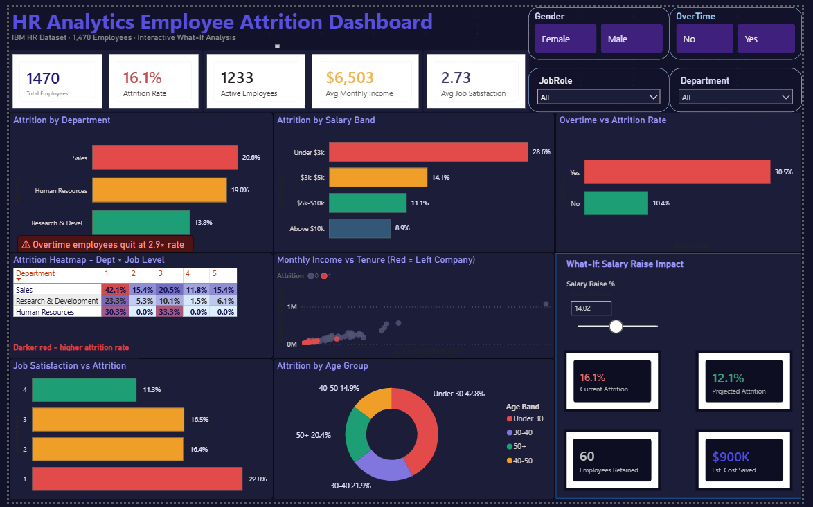

# HR Analytics Employee Attrition Dashboard
### Power BI | DAX | Power Query | IBM HR Dataset | 1,470 Employees



---

## 📊 Project Overview

This is a single-page interactive HR Analytics dashboard built in Power BI using the real IBM HR Employee Attrition dataset. The goal was not just to visualize attrition data — but to find the actual business insights hidden inside 1,470 employee records and present them in a way that HR managers can act on immediately.

This is my first advanced Power BI project. Every visual, every DAX measure, and every insight was built from scratch — no template, no guided walkthrough.

---

## 🔍 Key Findings

| Finding | Number |
|---|---|
| Overall attrition rate | **16.1%** (237 of 1,470 employees left) |
| Highest attrition department | **Sales — 20.6%** |
| Highest attrition role | **Sales Representatives — 39.8%** |
| Highest single heatmap cell | **Sales Level 1 — 42.1%** |
| Overtime attrition rate | **30.5%** vs 10.4% without overtime (2.9× gap) |
| Lowest salary band attrition | **Under $3k/month — 28.6%** |
| Highest salary band attrition | **Above $10k/month — 8.9%** |
| Lowest satisfaction attrition | **Score 1/4 — 22.8%** vs 11.3% for score 4 |
| Under-30 share of departures | **42.8%** of all leavers |
| What-If at 14% raise | Projected attrition drops **16.1% → 12.1%** |
| Employees retained at 14% raise | **60 employees** |
| Estimated cost saved | **$900,000** annually |

---

## 💡 Business Insights

**1 — Sales department needs immediate intervention**
Sales has the highest attrition at 20.6% — 50% above the company average. Sales Representatives quit at 39.8% and entry-level Sales employees (Level 1) leave at 42.1%. The root cause: Sales has the lowest work-life balance score in the company.

**2 — Overtime is the single most controllable attrition driver**
Employees working overtime leave at 30.5% vs 10.4% for those without overtime — a 2.9× gap. This is the highest-ROI action because management can reduce overtime requirements immediately without large budget changes.

**3 — Salary is a major predictor of attrition**
Employees earning under $3,000/month leave at 28.6% — more than 3× the rate of employees earning above $10,000. A targeted salary increase for the lowest earners is the single most cost-effective retention strategy.

**4 — Young employees are leaving disproportionately**
Under-30 employees make up 42.8% of all departures despite being a minority of the total workforce. Combined with low tenure data from the scatter plot, this shows that new hires are leaving before they become productive — a significant onboarding and early-career support problem.

**5 — The What-If analysis quantifies the ROI of salary raises**
A 14% salary raise for the lowest earners projects attrition dropping from 16.1% to 12.1%, retaining approximately 60 employees. At an industry-standard $15,000 replacement cost per employee, this saves an estimated $900,000 annually — making the salary raise cost-effective even before considering productivity benefits.

---

## 🛠️ Technical Features

### Data Cleaning — Power Query
- Removed 3 constant columns: EmployeeCount (always 1), StandardHours (always 80), Over18 (always Y)
- Converted Attrition column from Yes/No text to 1/0 integers for DAX calculations
- Created Age Band column: Under 30, 30-40, 40-50, 50+
- Created Salary Band column: Under $3k, $3k-$5k, $5k-$10k, Above $10k

### DAX Measures
```dax
Total Employees = COUNTROWS(HR_Employees)

Attrition Count = SUM(HR_Employees[Attrition])

Attrition Rate = DIVIDE([Attrition Count], [Total Employees], 0)

Active Employees = [Total Employees] - [Attrition Count]

Avg Monthly Income = AVERAGE(HR_Employees[MonthlyIncome])

Avg Job Satisfaction = AVERAGE(HR_Employees[JobSatisfaction])

Attrition Rate Overtime =
CALCULATE([Attrition Rate], HR_Employees[OverTime] = "Yes")

Attrition Rate No Overtime =
CALCULATE([Attrition Rate], HR_Employees[OverTime] = "No")

Projected Attrition Rate =
VAR SalaryRaise = SELECTEDVALUE('Salary Increase'[Salary Increase], 0)
RETURN [Attrition Rate] * (1 - SalaryRaise)

Employees Retained =
ROUND(([Attrition Rate] - [Projected Attrition Rate]) * [Total Employees], 0)

Cost Saved = [Employees Retained] * 15000
```

### Visuals Built
| Visual | Purpose |
|---|---|
| 5 KPI Cards | Total employees, attrition rate, active employees, avg income, avg satisfaction |
| Department bar chart | Compare attrition rate across 3 departments |
| Salary band bar chart | Show relationship between salary and attrition |
| Overtime bar chart | Compare attrition with and without overtime |
| Heatmap matrix | Department × Job Level attrition with gradient conditional formatting |
| Scatter plot | Monthly income vs years at company — colored by attrition |
| Donut chart | Attrition split by age group |
| Job satisfaction bar chart | Attrition rate by satisfaction score (1-4) |
| What-If slider | Salary raise parameter — projects attrition change in real time |
| 4 Interactive slicers | Gender, OverTime, JobRole, Department |

### What-If Parameter
Built using Power BI's Numeric Range parameter (0 to 0.30, decimal). The slider value feeds directly into the Projected Attrition Rate measure, which cascades to Employees Retained and Cost Saved — all updating in real time as the user drags the slider.

---

## 📁 Files in This Repository

```
hr-analytics-dashboard/
│
├── README.md                          ← This file
├── HR_Analytics_Dashboard.pbix        ← Power BI dashboard file
├── WA_Fn-UseC_-HR-Employee-Attrition.csv  ← Original dataset
└── dashboard_preview.png              ← Dashboard screenshot
```

---

## 🗂️ Dataset

**Source:** IBM HR Analytics Employee Attrition & Performance  
**Available on:** [Kaggle](https://www.kaggle.com/datasets/pavansubhasht/ibm-hr-analytics-attrition-dataset)  
**Records:** 1,470 employees  
**Columns:** 35 (32 after cleaning)  
**Time period:** Cross-sectional HR snapshot

---

## 🚀 How to Use This Dashboard

1. Download Power BI Desktop (free) from microsoft.com/power-bi
2. Clone or download this repository
3. Open `HR_Analytics_Dashboard.pbix` in Power BI Desktop
4. Use the slicers (Gender, OverTime, JobRole, Department) to filter all visuals simultaneously
5. Drag the Salary Raise % slider to model different salary increase scenarios
6. Hover over heatmap cells to see exact attrition rates for each department × job level combination

---

## 📈 Tools & Technologies

- **Power BI Desktop** — dashboard development
- **DAX** — CALCULATE, DIVIDE, COUNTROWS, SELECTEDVALUE, ROUND, VAR/RETURN
- **Power Query (M language)** — data cleaning, custom columns, type conversion
- **What-If Parameters** — numeric range parameter for salary simulation

---

## 👤 About Me

I am a Data Analyst and Computer Science graduate (COMSATS University Islamabad, June 2026) specialising in Power BI, SQL, Python, Tableau, and Excel. I turn raw, messy data into clear dashboards and business decisions.

- 🌐 LinkedIn: [https://www.linkedin.com/in/saifdataanalyst/](https://linkedin.com)
- 📧 Email: saifulislam.ravian@gmail.com

---

## 📝 Credits

- Dataset: IBM HR Analytics — available publicly on Kaggle
- Learning foundation: [Alex the Analyst](https://www.youtube.com/@AlexTheAnalyst) Data Analytics Bootcamp
- Dashboard design inspiration: [Mansi G](https://www.youtube.com/@Mansi.goel.offical) on YouTube

---

*This project was built entirely from scratch as part of my data analytics portfolio. All findings and insights are derived from the real IBM dataset.*
